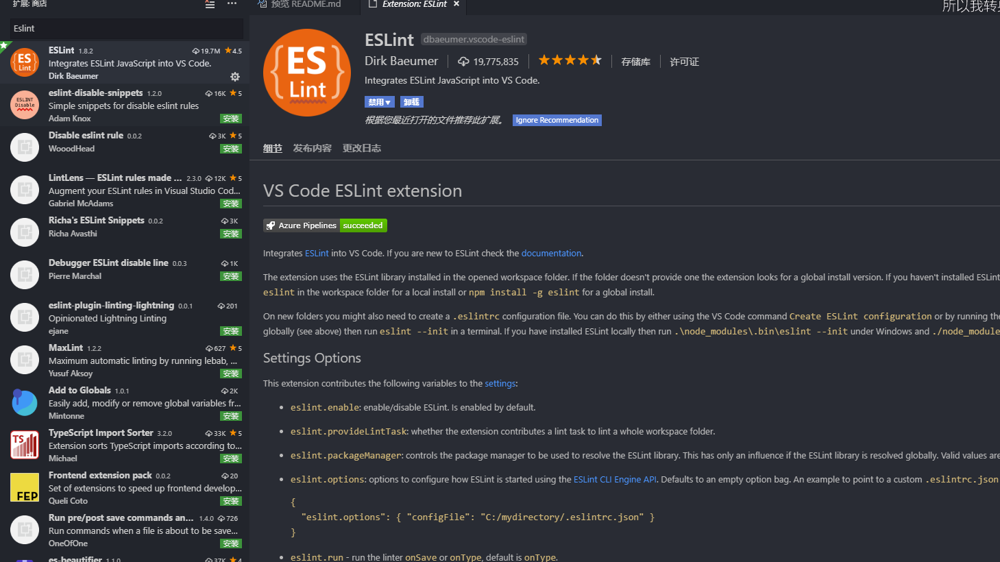

##	为什么是Eslint
-	使用空格还是Tab     
-   一次缩进是 2 个空格还是 4 个空格 还是 8 个空格  
-   字符串使用单引号还是双引号  
-   JavaScript 一行结尾到底要不要加分号     
-   关键字前后要不要加空格  
-   等等等等... 
>   [ESLint(中文站点)](http://eslint.cn/docs/user-guide/configuring)是一个开源的 JavaScript 代码检查工具，使用 Node.js 编写，由 Nicholas C. Zakas 于 2013 年 6 月创建。ESLint 的初衷是为了让程序员可以创建自己的检测规则，使其可以在编码的过程中发现问题而不是在执行的过程中。ESLint 的所有规则都被设计成可插入的，为了方便使用，ESLint 内置了一些规则，在这基础上也可以增加自定义规则
##	安装环境
```js
node@6.9.1
webpack@4.30.0
npm@6.9.0

eslint@5.1.0
eslint-plugin-prettier@3.0.1
eslint-config-prettier@4.2.0
babel-eslint@10.0.1
eslint-config-standard@3.1.0
eslint-plugin-node@4.1.0
eslint-plugin-node@4.1.0
```
##	安装Eslint拓展（Windows 10系统下）
---
###	VScode安装
-	vscode(最新版)
####	Eslint插件(编辑器提示错误)
首先，打开 VSCode 扩展面板并搜索 ESLint 扩展，然后点击安装	

###	WebStorn安装
-	webStorn(最新版)
####	Eslint插件
file->setting->plgun
##  在项目中使用
-	全局安装，编译期检测报错。（方便以后不用重复安装，项目安装也可以这里就不赘述了）
```js
npm i -g eslint
```
-	安装eslint加载器，用于构建检测
```
cnpm i eslint-loader -D
```
安装完以后，在项目的根目录新建.eslintrc.js文件、或者自动生成，也可以选择生成JSON文件。
```js
eslint	--init
/*命令行输出  带*的为磁盘和项目路径*/
PS *:\*> eslint --init
    ? How would you like to configure ESLint? Answer questions about your style
    ? Are you using ECMAScript 6 features? Yes
    ? Are you using ES6 modules? Yes
    ? Where will your code run? Browser
    ? Do you use CommonJS? Yes
    ? Do you use JSX? Yes
    ? Do you use React? No
    ? What style of indentation do you use? Tabs
    ? What quotes do you use for strings? Double
    ? What line endings do you use? Windows
    ? Do you require semicolons? Yes
    ? What format do you want your config file to be in? JSON
    Successfully created .eslintrc.json file in F:\digitalChina\projects\sientest
```
.eslintrc.js文件内容，还可以参考[ESLint(中文站点)](http://eslint.cn/docs/user-guide/configuring)查看自己需要更改的配置，添加在 ``rules``里
```js
module.exports = {
    env: {
        browser: true,
        commonjs: true,
        es6: true
    },
    extends: "eslint:recommended",
    parserOptions: {
        ecmaFeatures: {
            experimentalObjectRestSpread: true,
            jsx: true
        },
        sourceType: "module"
    },
    plugins: [],
    rules: {
        semi: [2, "always"], //语句强制分号结尾
        "no-extra-semi": 2, //禁止多余的分号
        indent: ["error", 4], //使用4个空格进行缩进
        eqeqeq: ["error", "smart"] //必须使用 === 或 !==，禁止使用 == 或 !=，与 null 比较时除外
    }
};
```
使用 env 属性来指定要启用的环境，将其设置为 true，以保证在进行代码检测时不会把这些环境预定义的全局变量识别成未定义的变量而报错：
```js
"env": {
    browser: true,
	commonjs: true,
	es6: true
}
```
-	在package.json文件中添加eslintConfig配置节点
```json
"eslintConfig": {
	"env": {
		"browser": true,
		"commonjs": true,
		"es6": true
	},
	"extends": "eslint:recommended",
	"rules": {
		"no-console": "error"
	}
}
```
在上文的配置文件中， "extends": "eslint:recommended" 选项表示启用推荐规则，在推荐规则的基础上我们还可以根据需要使用 rules 新增自定义规则，每个规则的第一个值都是代表该规则检测后显示的错误级别：	

"off" 或 0 - 关闭规则		

"warn" 或 1 - 将规则视为一个警告		

"error" 或 2 - 将规则视为一个错误
		